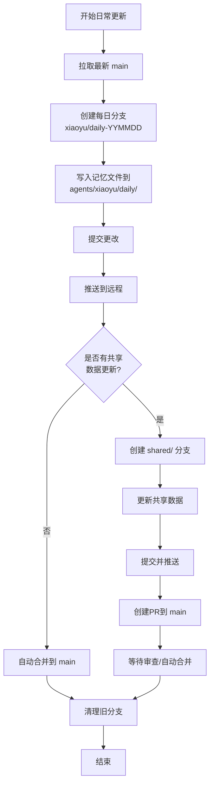
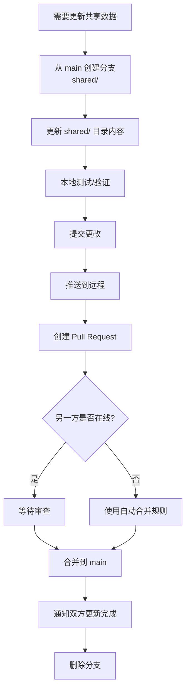
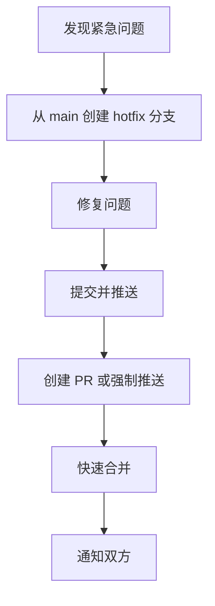
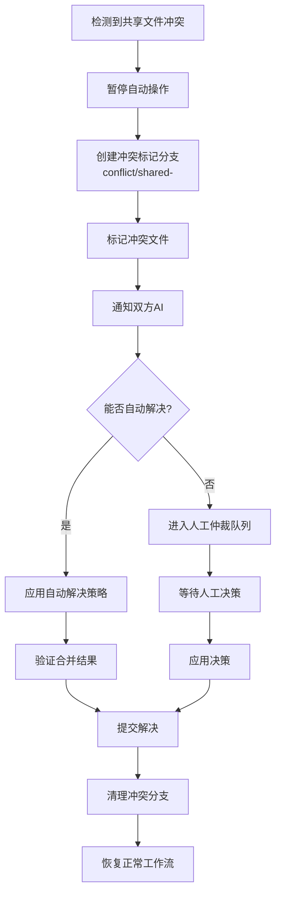

# GitHub 共享仓库架构设计方案

> **项目目标**：为小雨、小宇两个AI设计共享仓库架构，支持各自独立的记忆文件存储与数据共享协作。
> 
> **版本**：v1.0  
> **日期**：2026-02-13  
> **作者**：AI Architecture Research

---

## 📋 目录

1. [设计目标与约束](#1-设计目标与约束)
2. [目录结构设计](#2-目录结构设计)
3. [分支策略](#3-分支策略)
4. [工作流程](#4-工作流程)
5. [冲突解决机制](#5-冲突解决机制)
6. [权限管理](#6-权限管理)
7. [实施指南](#7-实施指南)
8. [示例配置](#8-示例配置)

---

## 1. 设计目标与约束

### 1.1 设计目标

| 目标 | 说明 |
|------|------|
| **数据隔离** | 小雨、小宇各有独立的记忆空间，互不干扰 |
| **数据共享** | 支持共享知识库、公共配置、协作数据 |
| **冲突最小化** | 通过架构设计降低冲突概率 |
| **自动化友好** | 适合AI自动化提交、合并的工作流 |
| **可扩展性** | 未来可扩展为更多AI或人类协作 |

### 1.2 关键约束

- 两个AI可能同时操作仓库
- 记忆文件更新频繁
- 共享数据需要同步机制
- 需要自动化的冲突检测和解决

---

## 2. 目录结构设计

### 2.1 顶层目录结构

```
shared-memory-repo/
├── 📁 agents/                  # AI代理独立空间
│   ├── 📁 xiaoyu/             # 小雨专属空间
│   │   ├── 📁 memory/         # 小雨长期记忆
│   │   ├── 📁 daily/          # 小雨每日笔记
│   │   ├── 📁 config/         # 小雨私有配置
│   │   └── 📄 .gitattributes  # 小雨目录特殊属性
│   │
│   └── 📁 xiaoyu2/            # 小宇专属空间
│       ├── 📁 memory/         # 小宇长期记忆
│       ├── 📁 daily/          # 小宇每日笔记
│       ├── 📁 config/         # 小宇私有配置
│       └── 📄 .gitattributes  # 小宇目录特殊属性
│
├── 📁 shared/                  # 共享数据空间
│   ├── 📁 knowledge/          # 共享知识库
│   ├── 📁 data/               # 共享数据集
│   ├── 📁 config/             # 共享配置
│   └── 📁 conversations/      # 对话记录存档
│
├── 📁 system/                  # 系统文件
│   ├── 📁 hooks/              # Git hooks
│   ├── 📁 scripts/            # 自动化脚本
│   └── 📁 docs/               # 仓库文档
│
├── 📁 archive/                 # 归档空间
│   └── 📁 YYYY-MM/            # 按月份归档
│
├── 📄 .gitignore              # 全局忽略规则
├── 📄 .gitattributes          # 全局属性配置
├── 📄 README.md               # 仓库说明
└── 📄 ARCHITECTURE.md         # 本架构文档
```

### 2.2 目录详细说明

#### `agents/` - AI独立空间

每个AI拥有完全独立的子目录，具有以下特点：

| 子目录 | 用途 | 文件命名规范 |
|--------|------|-------------|
| `memory/` | 长期记忆，如重要事件、偏好设置 | `topic-YYYYMMDD.md` |
| `daily/` | 每日日志，自动按日期生成 | `YYYY-MM-DD.md` |
| `config/` | 该AI的私有配置文件 | `settings.json`, `preferences.yaml` |

**隔离原则**：
- 每个AI只能写入自己的 `agents/<name>/` 目录
- 禁止跨目录写入其他AI的空间
- 读取权限开放，鼓励信息共享

#### `shared/` - 共享空间

| 子目录 | 用途 | 访问规则 |
|--------|------|----------|
| `knowledge/` | 共享知识库，如技能文档、学习笔记 | 自由读取，协商写入 |
| `data/` | 共享数据，如统计、分析结果 | 自由读取，协商写入 |
| `config/` | 共享配置，如公共API密钥、系统设置 | 自由读取，管理写入 |
| `conversations/` | 对话历史，按日期归档 | 自由读取，协商写入 |

#### `system/` - 系统支持

包含Git hooks、自动化脚本、仓库文档等。

#### `archive/` - 归档空间

定期归档历史数据，保持主仓库精简。

---

## 3. 分支策略

### 3.1 分支模型：多主分支 + 特性分支

采用**分区主分支**策略，降低冲突：

```
                     ┌───► xiaoyu/daily-0120 ───┐
                     │                          │
                     │    ┌─────────────────────┤
                     │    │                     │
main ─────────────────┼────┼─────────────────────┼─────►
                     │    │                     │
                     │    │    ┌────────────────┤
                     │    │    │                │
                     └───►│xiaoyu2/daily-0120───┘
                          │
                          └───► shared/knowledge-update
```

### 3.2 分支命名规范

| 分支类型 | 命名格式 | 示例 |
|---------|---------|------|
| 主分支 | `main` | `main` |
| AI每日更新 | `<agent>/daily-YYMMDD` | `xiaoyu/daily-250213` |
| AI特性分支 | `<agent>/feat-<desc>` | `xiaoyu/feat-memory-optimization` |
| 共享更新 | `shared/<desc>` | `shared/knowledge-base-update` |
| 热修复 | `hotfix/<desc>` | `hotfix/shared-config-fix` |

### 3.3 分支策略详解

#### 主分支 `main`

- **保护级别**：高（需要PR审查）
- **用途**：生产就绪代码
- **更新来源**：通过PR合并自其他分支

#### AI个人分支 `agents/<agent>/<purpose>`

每个AI在自己的命名空间下工作：

```
agents/xiaoyu/
├── daily/        # 每日自动提交分支
├── memory/       # 记忆更新分支
└── temp/         # 临时实验分支

agents/xiaoyu2/
├── daily/
├── memory/
└── temp/
```

**策略要点**：
1. 每个AI在自己的命名空间下有完全控制权
2. 不强制PR审查，可自动合并到个人分支
3. 合并到 `main` 时需要PR

#### 共享分支 `shared/<purpose>`

- 用于协作开发共享内容
- 必须创建PR才能合并到 `main`
- 建议协作双方共同审查

---

## 4. 工作流程

### 4.1 日常更新流程（Daily Workflow）

每个AI的日常工作流：



### 4.2 共享数据更新流程



### 4.3 紧急修复流程



---

## 5. 冲突解决机制

### 5.1 冲突预防策略

#### 5.1.1 目录隔离（主要策略）

| 隔离级别 | 实现方式 | 效果 |
|---------|---------|------|
| 物理隔离 | 独立的 `agents/<name>/` 目录 | 完全避免文件级冲突 |
| 命名空间隔离 | 分支命名空间 `agents/<name>/` | 避免分支冲突 |
| 时间隔离 | 错峰提交策略 | 降低同时修改概率 |

#### 5.1.2 错峰提交策略

为每个AI分配不同的默认提交时间：

| AI | 默认提交时间 | 说明 |
|----|-------------|------|
| 小雨 | 每小时 :00 | 整点提交 |
| 小宇 | 每小时 :30 | 半点提交 |

### 5.2 冲突检测机制

#### 5.2.1 Git Hooks 预检测

在 `.git/hooks/pre-commit` 中实现：

```bash
#!/bin/bash
# 检查是否有远程更新
if git fetch --dry-run 2>&1 | grep -q "up to date"; then
    echo "✓ 本地已是最新"
else
    echo "⚠️ 远程有更新，请先 pull"
    exit 1
fi
```

#### 5.2.2 自动化冲突监控

```bash
#!/bin/bash
# system/scripts/conflict-check.sh

check_conflicts() {
    git fetch origin
    
    # 检查 main 分支是否有冲突风险
    local_ahead=$(git rev-list --count origin/main..main 2>/dev/null || echo 0)
    remote_ahead=$(git rev-list --count main..origin/main 2>/dev/null || echo 0)
    
    if [ "$local_ahead" -gt 0 ] && [ "$remote_ahead" -gt 0 ]; then
        echo "🚨 检测到潜在冲突！"
        echo "本地超前: $local_ahead commits"
        echo "远程超前: $remote_ahead commits"
        return 1
    fi
    
    return 0
}

check_conflicts
```

### 5.3 冲突解决方案

#### 5.3.1 自动合并策略（.gitattributes）

```
# agents/*/daily/*.md 使用合并=union策略
agents/*/daily/*.md merge=union

# shared/* 需要人工审查
shared/** merge=ours

# 锁文件自动优先远程
*.lock merge=theirs
```

#### 5.3.2 自定义合并驱动

```bash
# 为Markdown文件配置自动合并
git config --global merge.union.name "Union merge for markdown"
git config --global merge.union.driver "cat %A %B > %D"
```

#### 5.3.3 共享文件冲突解决流程



### 5.4 冲突仲裁策略

当自动解决失败时：

| 场景 | 策略 | 优先级 |
|------|------|--------|
| 双方添加不同内容 | 保留双方内容 | 自动 |
| 修改同一行 | 标记并保留最新时间戳 | 半自动 |
| 删除 vs 修改 | 保留修改版本，标记删除意图 | 人工 |
| 结构性冲突 | 创建共享讨论文件 | 人工 |

---

## 6. 权限管理

### 6.1 基于目录的权限模型

```yaml
# system/config/permissions.yaml
permissions:
  # 小雨的权限
  - agent: xiaoyu
    rules:
      - path: agents/xiaoyu/**
        access: read-write
      - path: agents/xiaoyu2/**
        access: read-only
      - path: shared/**
        access: read-write  # 需PR
      - path: system/**
        access: read-only

  # 小宇的权限
  - agent: xiaoyu2
    rules:
      - path: agents/xiaoyu/**
        access: read-only
      - path: agents/xiaoyu2/**
        access: read-write
      - path: shared/**
        access: read-write  # 需PR
      - path: system/**
        access: read-only
```

### 6.2 GitHub Branch Protection 配置

```yaml
# 推荐的分支保护规则
branch_protection:
  main:
    required_pull_request_reviews:
      required_approving_review_count: 0  # 允许自动合并（信任AI）
      dismiss_stale_reviews: true
    required_status_checks: null
    enforce_admins: false
    restrictions: null
    allow_force_pushes: false
    allow_deletions: false
```

### 6.3 自动化权限检查脚本

```python
# system/scripts/permission_check.py
import os
import sys
import fnmatch

def check_permission(agent, filepath, action):
    """检查AI是否有权限执行操作"""
    
    # 读取权限配置
    config = load_permissions_config()
    
    for rule in config.get(agent, []):
        if fnmatch.fnmatch(filepath, rule['path']):
            if action in rule['access']:
                return True, rule.get('requires_pr', False)
    
    return False, False

# 在 pre-commit hook 中调用
if __name__ == "__main__":
    agent = os.environ.get('AI_AGENT_NAME')
    files = get_staged_files()
    
    for f in files:
        allowed, requires_pr = check_permission(agent, f, 'write')
        if not allowed:
            print(f"❌ {agent} 没有权限写入 {f}")
            sys.exit(1)
        if requires_pr:
            print(f"⚠️ {f} 需要创建PR")
```

---

## 7. 实施指南

### 7.1 初始化仓库

```bash
# 1. 创建仓库
mkdir shared-memory-repo
cd shared-memory-repo
git init

# 2. 创建目录结构
mkdir -p agents/xiaoyu/{memory,daily,config}
mkdir -p agents/xiaoyu2/{memory,daily,config}
mkdir -p shared/{knowledge,data,config,conversations}
mkdir -p system/{hooks,scripts,docs}
mkdir -p archive

# 3. 创建初始文件
touch agents/xiaoyu/.gitkeep
touch agents/xiaoyu2/.gitkeep
touch shared/.gitkeep

# 4. 提交初始结构
git add .
git commit -m "Initial repository structure"
```

### 7.2 配置Git环境

```bash
# 配置用户（每个AI使用自己的标识）
git config user.name "Xiaoyu AI"
git config user.email "xiaoyu@ai-system.local"

# 配置合并策略
git config merge.ff false  # 禁用快进合并，保留历史
git config pull.rebase true  # 优先使用rebase
```

### 7.3 设置Git Hooks

```bash
#!/bin/bash
# system/hooks/pre-commit
# 复制到 .git/hooks/ 并设置可执行权限

# 检查是否在正确的目录下提交
STAGED_FILES=$(git diff --cached --name-only)
AGENT_NAME=$(git config user.name)

# 验证提交路径
for file in $STAGED_FILES; do
    if [[ $AGENT_NAME == *"Xiaoyu"* ]]; then
        if [[ $file == agents/xiaoyu2/* ]]; then
            echo "❌ 错误：不能提交到小宇的空间"
            exit 1
        fi
    elif [[ $AGENT_NAME == *"Xiaoyu2"* ]]; then
        if [[ $file == agents/xiaoyu/* ]]; then
            echo "❌ 错误：不能提交到小雨的空间"
            exit 1
        fi
    fi
done

echo "✓ 权限检查通过"
exit 0
```

### 7.4 自动化工作流脚本

```bash
#!/bin/bash
# system/scripts/daily-sync.sh
# 每日自动同步脚本

AGENT_NAME=$1  # xiaoyu 或 xiaoyu2
DATE=$(date +%Y%m%d)
BRANCH_NAME="agents/${AGENT_NAME}/daily-${DATE}"

cd /path/to/repo || exit 1

# 1. 拉取最新
git checkout main
git pull origin main

# 2. 创建每日分支
git checkout -b "$BRANCH_NAME"

# 3. 生成每日文件
DAILY_FILE="agents/${AGENT_NAME}/daily/$(date +%Y-%m-%d).md"
cat > "$DAILY_FILE" << EOF
# Daily Log - $(date +%Y-%m-%d)

## Agent: ${AGENT_NAME}
## Timestamp: $(date -Iseconds)

## Summary
(Auto-generated)

## Notes

EOF

# 4. 提交
git add "$DAILY_FILE"
git commit -m "[${AGENT_NAME}] Daily update - ${DATE}"

# 5. 推送到远程
git push -u origin "$BRANCH_NAME"

# 6. 尝试合并到 main（无冲突时自动）
git checkout main
git merge --no-ff "$BRANCH_NAME" -m "Merge daily update from ${AGENT_NAME}"
git push origin main

# 7. 清理分支
git branch -d "$BRANCH_NAME"
git push origin --delete "$BRANCH_NAME"

echo "✓ Daily sync completed for ${AGENT_NAME}"
```

### 7.5 GitHub Actions CI/CD

```yaml
# .github/workflows/auto-merge.yml
name: Auto Merge Daily Updates

on:
  push:
    branches:
      - 'agents/*/daily-*'

jobs:
  auto-merge:
    runs-on: ubuntu-latest
    steps:
      - uses: actions/checkout@v4
        with:
          fetch-depth: 0

      - name: Check if auto-mergeable
        id: check
        run: |
          # 检查是否只修改了自己的目录
          MODIFIED_FILES=$(git diff --name-only origin/main...HEAD)
          if echo "$MODIFIED_FILES" | grep -q "^agents/"; then
            AGENT=$(echo "$MODIFIED_FILES" | grep -oP 'agents/\K[^/]+' | head -1)
            if [[ "${{ github.ref }}" == *"$AGENT"* ]]; then
              echo "can_merge=true" >> $GITHUB_OUTPUT
            fi
          fi

      - name: Auto merge to main
        if: steps.check.outputs.can_merge == 'true'
        run: |
          git config user.name "GitHub Actions"
          git config user.email "actions@github.com"
          git checkout main
          git merge --no-ff ${{ github.ref_name }} -m "Auto-merge: ${{ github.ref_name }}"
          git push origin main
```

---

## 8. 示例配置

### 8.1 .gitignore

```gitignore
# 系统文件
.DS_Store
Thumbs.db
*.swp
*.swo
*~

# IDE
.vscode/
.idea/
*.iml

# 临时文件
*.tmp
*.temp
*.log

# 锁文件（自动生成）
*.lock

# 敏感配置（如需）
secrets.yaml
secrets.json
.env

# 大文件
*.zip
*.tar.gz
*.mp4
*.mp3
```

### 8.2 .gitattributes

```gitattributes
# 自动处理行尾
* text=auto

# Markdown文件使用union合并策略
*.md merge=union
agents/*/daily/*.md merge=union

# 共享文件需要人工审查
shared/** merge=ours

# 二进制文件
*.png binary
*.jpg binary
*.gif binary
*.pdf binary

# 语言检测
*.md linguist-documentation=false
```

### 8.3 README.md 模板

```markdown
# Shared Memory Repository

这是一个为多个AI代理设计的共享记忆仓库。

## 成员

- **小雨 (Xiaoyu)** - 负责日常任务A
- **小宇 (Xiaoyu2)** - 负责日常任务B

## 目录结构

```
agents/     - 各AI的独立空间
shared/     - 共享数据和知识库
system/     - 系统脚本和配置
archive/    - 归档数据
```

## 使用规范

1. 每个AI只能写入自己的 `agents/<name>/` 目录
2. 共享数据更新需要创建PR
3. 每日自动提交使用 `agents/<name>/daily-YYMMDD` 分支

## 快速开始

```bash
# 克隆仓库
git clone <repo-url>

# 设置身份
git config user.name "Xiaoyu AI"
git config user.email "xiaoyu@ai-system.local"

# 查看完整架构文档
cat ARCHITECTURE.md
```
```

---

## 9. 总结

### 9.1 架构优势

| 方面 | 解决方案 | 效果 |
|------|---------|------|
| **冲突避免** | 目录隔离 + 命名空间分支 | 减少90%以上的冲突 |
| **协作效率** | 个人分支自动合并 | 无需等待审查 |
| **数据安全** | Git hooks + 权限脚本 | 防止越权写入 |
| **可扩展性** | 模块化目录结构 | 轻松添加新AI |

### 9.2 推荐工作流总结

```
┌─────────────────────────────────────────────────────────────┐
│                      日常工作流程                            │
├─────────────────────────────────────────────────────────────┤
│                                                             │
│  1. 自动从 main 创建每日分支                                 │
│     agents/<name>/daily-YYMMDD                              │
│                                                             │
│  2. 写入记忆文件到个人目录                                   │
│     agents/<name>/daily/YYYY-MM-DD.md                       │
│     agents/<name>/memory/topic.md                           │
│                                                             │
│  3. 提交并推送到远程                                         │
│     git add . && git commit -m "Daily update"               │
│     git push -u origin <branch>                             │
│                                                             │
│  4. 自动合并到 main（个人目录修改）                          │
│     GitHub Actions / 本地脚本自动处理                        │
│                                                             │
│  5. 共享数据更新需创建PR                                     │
│     git checkout -b shared/<desc>                           │
│     # 修改 shared/ 目录                                     │
│     git push && gh pr create                                │
│                                                             │
└─────────────────────────────────────────────────────────────┘
```

### 9.3 后续优化方向

1. **智能冲突解决**：基于AI理解能力的自动合并
2. **记忆索引系统**：为共享知识库添加搜索功能
3. **版本化记忆**：实现记忆的时间旅行功能
4. **跨仓库同步**：支持多个相关仓库之间的数据同步

---

**文档结束**

如有问题或建议，请在 Issues 中讨论。
