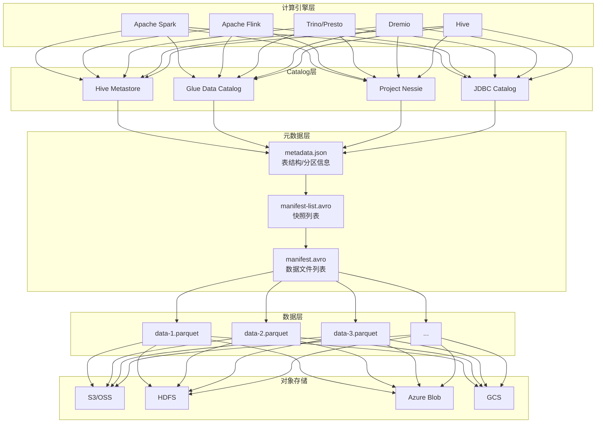
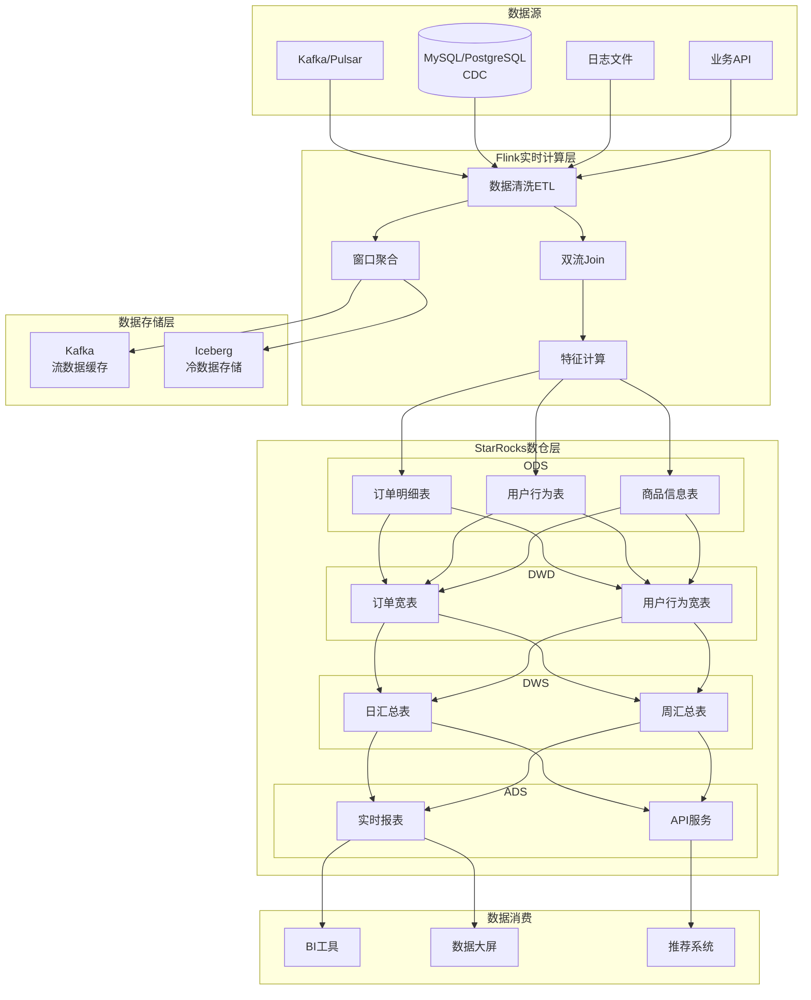
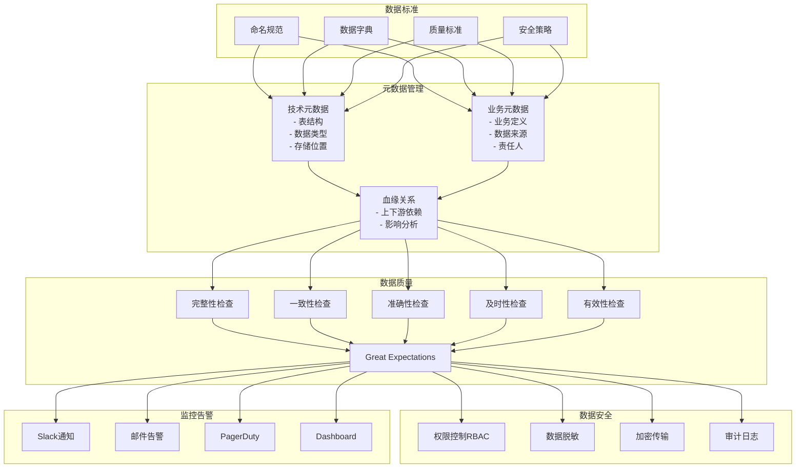
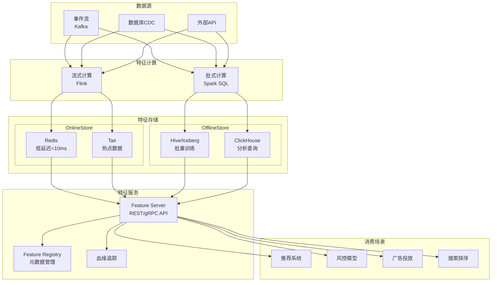
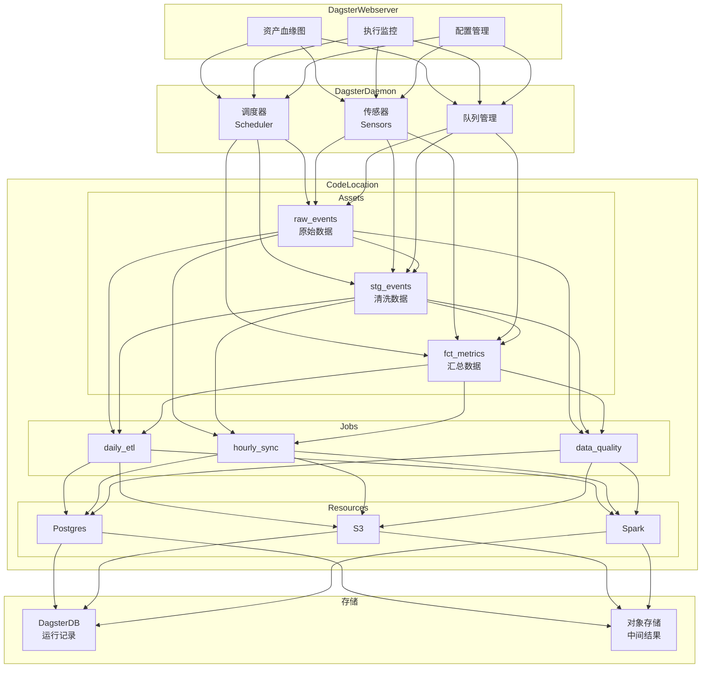
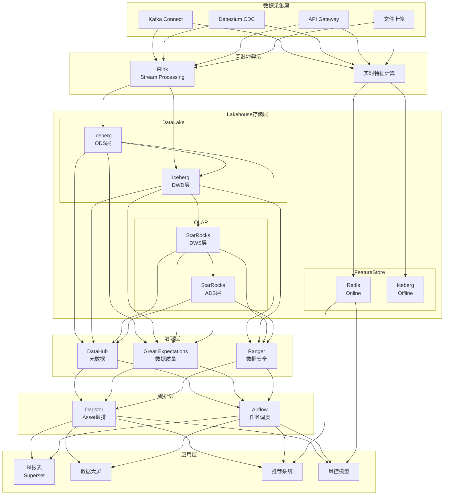
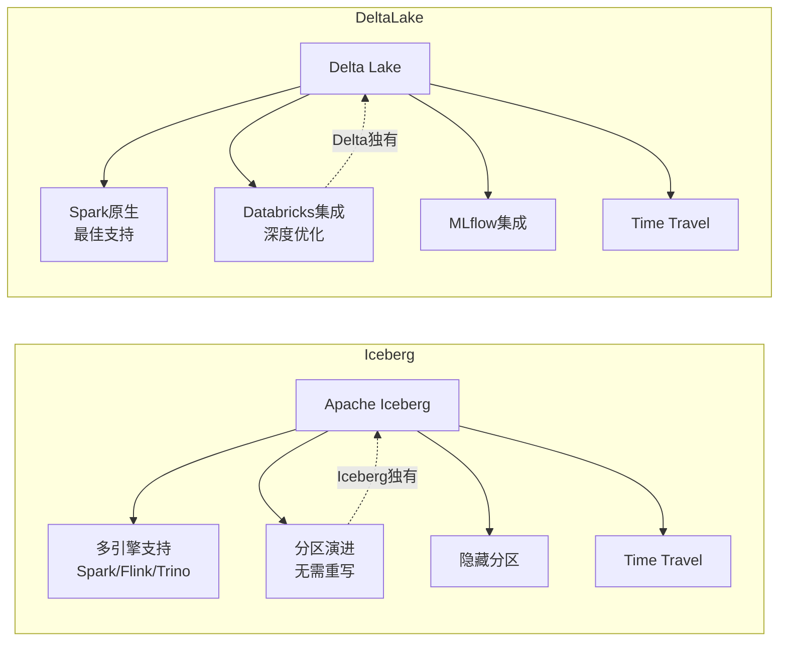
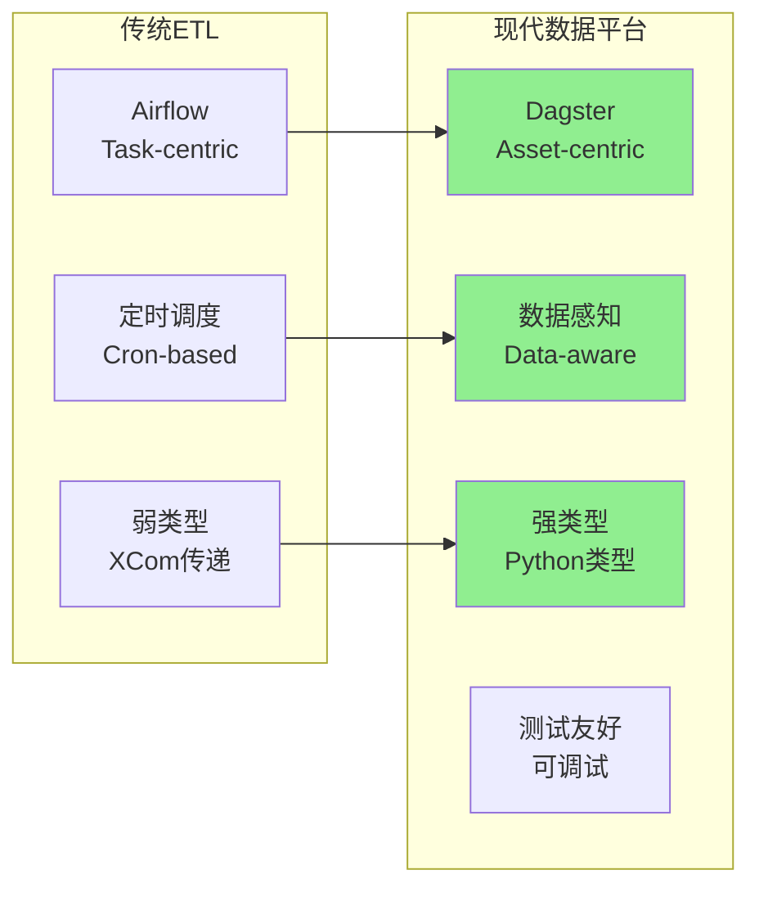

# 数据架构图集

本文档使用 Mermaid 语法绘制各层架构图

---

## 1. Lakehouse 架构图

---

## 2. 实时数仓架构 (Flink + StarRocks)

---

## 3. 数据治理架构

---

## 4. 实时特征平台架构

---

## 5. Dagster 编排架构

---

## 6. 整体 Lakehouse 架构

---

## 7. Iceberg vs Delta Lake 对比

---

## 8. 数据流水线编排演进

---

*生成时间: 2026-02-16*
